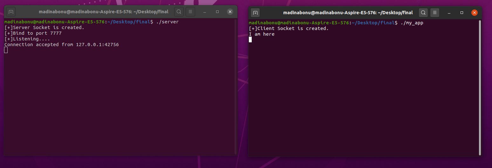
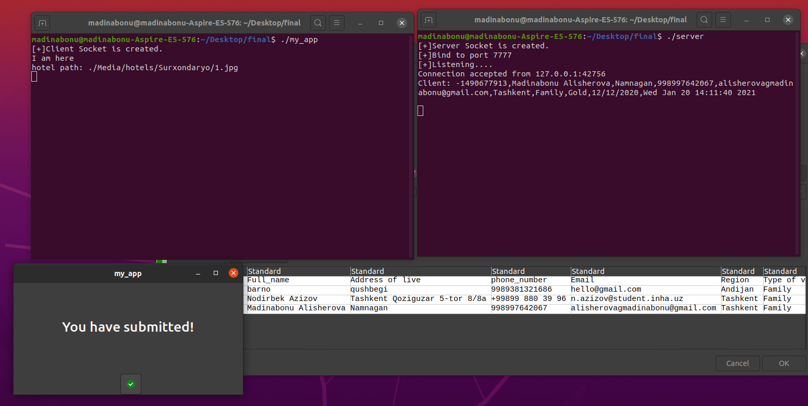

# Multithreading-server-side-connection-in-c

> ## Abstarct

 Uzbekistan has been potentially expanding with tourism industry visibly. So in central Asia, Uzbekistan is considered as one of the most historical, cultural and spiritual place. Uzbekistan attracts more tourists with not only its historical, architectural and natural treasures, but also traditional clothes and foods. As technology has been changing the world so as to produce comfort for the clients, many applications and companies are helping out for travelers to reach their destinations and to see those places safely. The problem currently many tourists are facing is that they look for hotels or some local cars to travel, but most of them are expensive or in Uzbekistan, there is no renting car and hotel together companies for tourists with affordable prices. So we were motivated and decided to create such portal for Uzbekistan tourism for all ranging from foreigner to local people. This application can help users to ease the travelling process much efficient. 

> #### This project's aim is to display multithreading socket connection between <em>server</em> and <em>client</em>! 

  <b> Sockets </b> are formed by following features: 
  * Protocol (TCP, UDP, raw IP) 
  * Local IP address 
  * Local port 
  * Remote IP address 
  * Remote port   

 Protocol – it is set of rules used for communications purposes globally. 
 Local IP address – it is the IP address of the local machine. 
 Local port – it is local port number. 
 Remote IP address – it is the IP address of the other machine on which local machine is connected  through Socket. 
 Remote port – it is the port number of the other machine.  
  

 In this project server and client can be connected using different pcs in the same LAN. But I showed here in one pc with two terminals. 

> `-` Server-side  
>  `-` Client-side 
  

  ## > Connection of <em> server </em> and <em> client </em>
  
  

  
  

  
  

  
  

  

